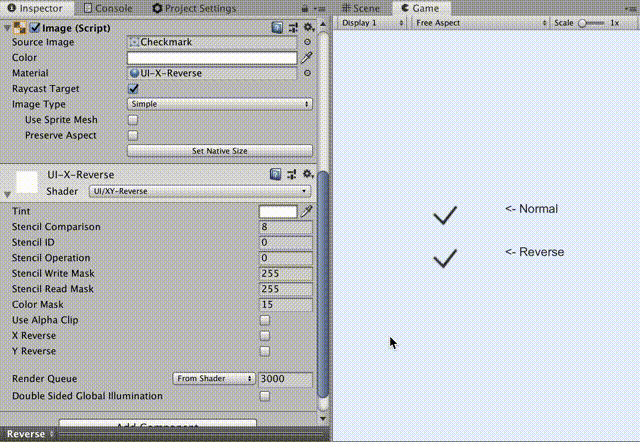

# xy\_reverse\_shader

## What

XY Reverse Shaders is uGUI Shader for reverse x, y axis.



## Install

```shell
yarn add "umm/xy_reverse_shader#^1.0.0"
```

## Examples

See [Assets/Examples](./Assets/Examples) folder

## License

Copyright (c) 2019 Takuma Maruyama

Released under the MIT license, see [LICENSE.txt](LICENSE.txt)

